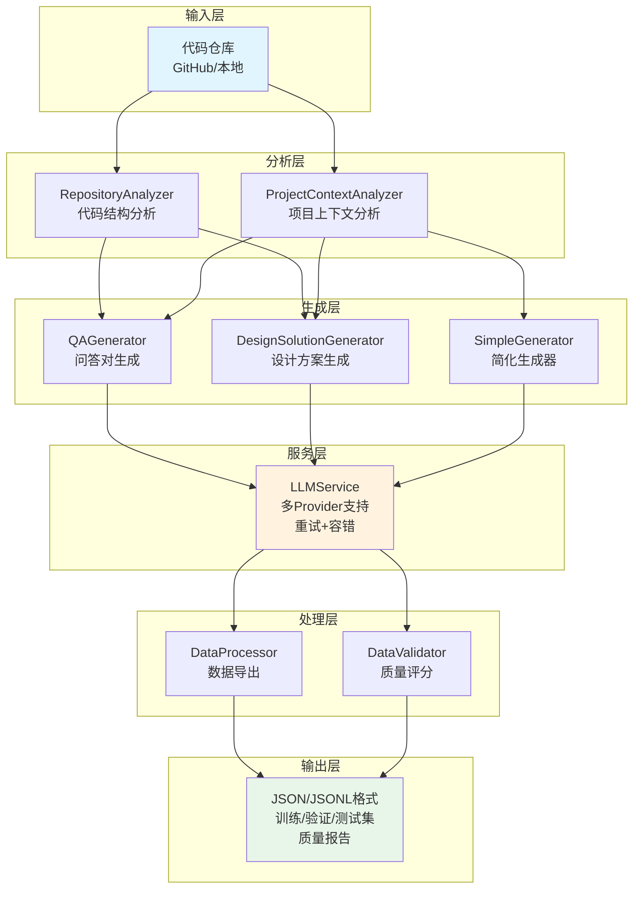

# 训练数据生成系统

> 基于代码仓库自动生成LLM训练数据

## 项目概述

自动化生成训练数据，支持两个核心场景：

- **场景1**：代码问答对生成（含推理轨迹）
- **场景2**：架构设计方案生成

核心特性：
- 支持任意GitHub项目或本地代码仓
- 项目上下文感知，提升问答质量
- **多样性问答和需求生成**，避免重复
- 支持多种LLM Provider (OpenAI/Anthropic/Gemini)
---

## 技术文档

查看项目根目录的 [技术文档.pdf](技术文档.pdf) 了解更多技术细节。

---

## 系统架构



**核心模块说明：**

| 模块 | 功能 | 特点 |
|------|------|------|
| RepositoryAnalyzer | 代码结构分析 | 提取函数、类、依赖关系 |
| ProjectContextAnalyzer | 上下文分析 | 三级上下文系统（minimal/standard/full） |
| QAGenerator | 问答生成 | 多类型问题，含推理轨迹 |
| DesignSolutionGenerator | 设计方案生成 | 动态需求，避免重复 |
| SimpleGenerator | 简化生成器 | 快速生成，支持模拟模式 |
| LLMService | LLM服务 | 重试机制、多Provider、容错 |
| DataProcessor | 数据处理 | 格式转换、数据集分割 |
| DataValidator | 质量评估 | 自动评分、生成报告 |

---

## 快速开始

### 安装依赖
```bash
pip install -r requirements.txt
cp .env.example .env  # 配置API密钥
```

### 使用方式

**交互式Notebook（推荐）**
```bash
jupyter notebook QuickStart_Tutorial.ipynb
```

**一行代码**
```python
from src.simple_generator import quick_generate
dataset = quick_generate("./your-project", num_qa=10, num_design=5)
```

**命令行**
```bash
python simple_example.py  # 交互式
# 或
python main.py --repo-path ./project --scenario both --num-qa 30
```

## 项目结构

```
├── src/                         # 核心代码
│   ├── simple_generator.py     # 主生成器
│   ├── context_analyzer.py     # 上下文分析
│   └── ...
├── config/                      # 配置文件
├── QuickStart_Tutorial.ipynb   # 教程
└── simple_example.py           # CLI工具
```

## 数据格式

**场景1：问答对**
```json
{
  "question": "函数功能是什么？",
  "answer": "详细答案...",
  "reasoning_steps": ["步骤1", "步骤2"],
  "code_context": "def function()...",
  "source_file": "main.py"
}
```

**场景2：设计方案**
```json
{
  "requirement": "添加认证功能",
  "solution": "采用JWT...",
  "steps": ["步骤1", "步骤2"],
  "files_to_modify": [{"file": "auth.py", "reason": "..."}]
}
```

## 配置

编辑 `config/config.yaml`:
```yaml
llm:
  provider: "gemini"
  model: "gemini-2.5-flash"
  temperature: 0.3

generation:
  num_qa_pairs: 10
  num_design_solutions: 5
  use_context: true  # 启用项目上下文分析
  context_level: "standard"  # minimal/standard/full
```
## 使用示例

### 1. 交互式快速开始 (simple_example.py)

**最简单的方式**，支持模拟模式，无需API密钥即可测试：

```bash
python simple_example.py
```

**交互式配置：**
- 选择项目路径
- 选择生成场景（QA/设计方案/两者）
- 设置生成数量
- 选择上下文级别（minimal/standard/full）

**输出：** `outputs/项目名/training_data.json`

---

### 2. 完整流程 (main.py)

**功能最完整**，包含代码分析、质量评分、数据验证：

```bash
python main.py \
  --repo-path "/path/to/repo" \
  --config config/config.yaml \
  --scenario both \
  --num-qa 30 \
  --num-design 10
```

**命令行参数：**
- `--repo-path`: 代码仓库路径（必填）
- `--scenario`: 生成场景 (qa/design/both)
- `--num-qa`: QA对数量（默认30）
- `--num-design`: 设计方案数量（默认10）
- `--config`: 配置文件路径
- `--output-dir`: 输出目录

**输出文件：**
- `qa_pairs.json` / `qa_pairs.jsonl` - 问答对数据
- `quality_report.json` - 质量报告
- `finetuning_data.jsonl` - 微调格式数据
- `train.jsonl` / `validation.jsonl` / `test.jsonl` - 训练/验证/测试集

---

### 3. Jupyter Notebook

#### QuickStart_Tutorial.ipynb（推荐）

**交互式教程**，包含完整示例和说明：

```bash
jupyter notebook QuickStart_Tutorial.ipynb
```

**内容：**
1. 环境设置和API配置
2. 简单生成器使用示例
3. 多层次问答生成演示
4. 数据格式和质量分析
5. 常见问题排查


### 4. API连接测试

在生成数据前测试API连接：

```bash
python test_api_connection.py
```

**测试内容：**
- ✅ 简单文本生成
- ✅ JSON格式响应
- ✅ 代码理解能力

---


## 输出格式

### Simple Generator 输出

```
outputs/项目名/
└── training_data.json    # 包含所有数据的单一文件
```

**内容结构：**
```json
{
  "qa_pairs": [...],
  "design_solutions": [...],
  "metadata": {
    "generated_at": "2025-12-19T12:00:00",
    "levels": {
      "minimal": {...},
      "standard": {...},
      "full": {...}
    }
  }
}
```

### Main.py 输出

```
data/processed/
├── qa_pairs.json           # 问答对（JSON格式）
├── qa_pairs.jsonl          # 问答对（JSONL格式）
├── quality_report.json     # 质量报告
├── finetuning_data.jsonl   # 微调格式数据
├── train.jsonl             # 训练集（80%）
├── validation.jsonl        # 验证集（10%）
└── test.jsonl              # 测试集（10%）
```

### QuickStart Notebook 输出

```
outputs/项目名/
└── training_data_[timestamp].json    # 带时间戳的输出文件
```

**输出内容：**
```json
{
  "qa_pairs": [
    {
      "question": "...",
      "answer": "...",
      "reasoning_steps": [...],
      "context_level": "standard"
    }
  ],
  "metadata": {
    "project_name": "项目名",
    "generated_at": "2025-12-19T13:16:46",
    "total_pairs": 10,
    "llm_model": "gemini-2.5-flash",
    "context_enabled": true
  }
}
```

---

## 🆘 故障排除

### Q: 运行main.py没有输出？

**完整命令示例：**
```bash
# 基本用法（仅生成QA对）
python main.py --repo-path "/path/to/your/project" --scenario qa --num-qa 10

# 生成QA对和设计方案
python main.py --repo-path "/path/to/your/project" --scenario both --num-qa 15 --num-design 5

# 使用自定义配置文件
python main.py --repo-path "/path/to/your/project" --config config/config.yaml --scenario both --num-qa 20

# 指定输出目录
python main.py --repo-path "/path/to/your/project" --scenario qa --num-qa 10 --output-dir ./my_output
```


### Q: JSON解析错误？

**说明：** 这是已知问题
- 系统已添加错误处理，不会中断流程
- 成功的数据会正常保存
- 查看控制台日志了解详细错误信息

### Q: 如何提高生成成功率？

**建议：**
1. 使用更稳定的模型
2. 降低温度参数（0.3 推荐）
3. 小批量生成（每次10-30个）


